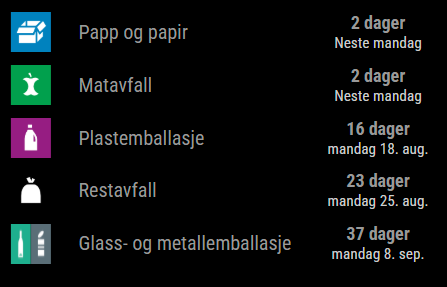
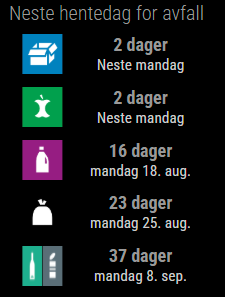

# MMM-VESAR

This is a MagicMirror² module for showing upcoming garbage collection dates for Vestfold.

##### Inspired by:

- https://github.com/blixhavn/MMM-AvfallshentingOslo
- https://github.com/reidarw/MMM-TRV-WastePlan

## Screenshot




## Installation

### Prerequisite

You must have [MagicMirror²](https://magicmirror.builders/) installed and running first.  
MMM-VESAR is a module for MagicMirror and will not work as a standalone application.

### Install

In your terminal, go to the modules directory and clone the repository:

```bash
cd ~/MagicMirror/modules
git clone https://github.com/ilsegs/MMM-VESAR
```

### Update

Go to the module directory and pull the latest changes:

```bash
cd ~/MagicMirror/modules/MMM-Vesar
git pull
```

## Dependencies

MMM-VESAR depends on the following Node.js packages, which are installed automatically when you run `npm install` in the module directory:

- **moment**: Used for date formatting and calculations.
- **cheerio**: Used for parsing HTML returned from the VESAR API.
- **node-fetch**: Used for making HTTP requests.

**Note:** You need to have MagicMirror² installed and running before you can use this module.

## Configuration

To use this module, you have to add a configuration object to the modules array in the `config/config.js` file.

```js
{
  module: "MMM-VESAR",
  position: "top_right",
  config: {
    header: "Neste hentedag for avfall",
    address: "Stasjonsveien 1, Horten",
    useHumanFormat: "by_week",
    dateFormat: "dddd Do MMM",
    showHeader: true,
    displayDate: true,
    displayNumberOfDays: true,
    displayIcons: true,
    displayWasteType: true,
    exclusions: []
  }
}
```

### Configuration options

| Option                | Type    | Default                     | Description                                                                                                                                                                                                               |
| --------------------- | ------- | --------------------------- | ------------------------------------------------------------------------------------------------------------------------------------------------------------------------------------------------------------------------- |
| `header`              | string  | "Neste hentedag for avfall" | Header text. Change or set empty string to remove.                                                                                                                                                                        |
| `address`             | string  | "Stasjonsveien 1, Horten"   | Change to your own address and town (use exact formatting as shown). This module covers Tønsberg, Horten, Sandefjord, Larvik, Holmestrand, Færder. Check [vesar.no](https://vesar.no/) to see if your address is covered. |
| `dateFormat`          | string  | "dddd Do MMM"               | Date format string, using [Moment.js tokens](https://momentjs.com/docs/#/displaying/format/). Example: `"dddd Do MMM"` for "Monday 4th Aug".                                                                              |
| `useHumanFormat`      | string  | "by_week"                   | How to format pickup dates. `"by_week"` formats as day of week, `"strict"` as raw date.                                                                                                                                   |
| `showHeader`          | boolean | true                        | Show the header above the table.                                                                                                                                                                                          |
| `displayDate`         | boolean | true                        | Show the next pickup date.                                                                                                                                                                                                |
| `displayNumberOfDays` | boolean | true                        | Show number of days until next pickup (e.g. "2 dager").                                                                                                                                                                   |
| `displayIcons`        | boolean | true                        | Display icons for each waste type.                                                                                                                                                                                        |
| `displayWasteType`    | boolean | true                        | Display the type of waste in text.                                                                                                                                                                                        |
| `exclusions`          | array   | []                          | Waste types to exclude from the list. Example: `["Restavfall"]`                                                                                                                                                           |

## Customization

You can easily customize MMM-VESAR to fit your needs:

- **Change address:**  
  Update the `address` field in your config to your street and town (e.g. `"Stasjonsveien 1, Horten"`).  
  Make sure the format matches exactly as used on [vesar.no](https://vesar.no).

- **Show or hide details:**  
  Use `displayDate` to show the next pickup date, and `displayNumberOfDays` to show the number of days until the next pickup ("today", "tomorrow", or "2 dager").  
  You can enable both, either, or neither, to control which information is shown.

- **Format dates:**  
  The `useHumanFormat` option lets you choose between `"by_week"` (display as day of week, e.g. "Monday") and `"strict"` (display the raw date).  
  Use `dateFormat` to customize how the date is formatted (e.g. `"dddd Do MMM"` for "Monday 4th Aug"). See [Moment.js format docs](https://momentjs.com/docs/#/displaying/format/) for details.

- **Icons and waste types:**  
  Set `displayIcons` to show or hide waste type icons.  
  Set `displayWasteType` to show or hide the waste type name as text.

- **Exclude waste types:**  
  Add types (e.g., `"Restavfall"`) to the `exclusions` array if you don't want them displayed.

- **Show/hide header:**  
  Use `showHeader` to show or hide the header above the table.

- **Styling:**  
  To adjust sizes or colors, edit `MMM-VESAR.css` in the module folder.

- **Translation:**  
  The module supports Norwegian and English out of the box. Set `language: "nb"` or `language: "en"` in your main MagicMirror `config.js` for your preferred language.

## Advanced Modification

For advanced changes (such as supporting other regions, more languages, or custom waste type translations), you can edit the files in the module folder:

- **Change waste type names:**  
  Edit the `wasteTypeTranslations` map in `MMM-VESAR.js` to show custom names for each waste type.

- **Add new translations:**  
  Create translation files in the `translations/` folder (e.g., `nb.json` for Norwegian, `en.json` for English).

## Troubleshooting

- If nothing is displayed:

  - Check MagicMirror logs (`pm2 logs mm`).
  - Make sure your config block has no syntax errors.
  - Verify you ran `npm install` in the `MMM-VESAR` directory.
  - Open your MagicMirror in a browser and check the developer console for errors.

- If the module is not updating:

  - Ensure your address is valid and covered by VESAR.
  - Try restarting MagicMirror: `pm2 restart mm`.

- For network access, ensure your MagicMirror config allows remote access:
  ```js
  address: "0.0.0.0",
  ipWhitelist: [],
  ```

## Changelog

See the [CHANGELOG.md](CHANGELOG.md) for version history and updates.

## Contributing

Pull requests are welcome! Please open an issue first to discuss major changes.

- Fork the repo
- Create your feature branch (`git checkout -b feature/MyFeature`)
- Commit changes (`git commit -am 'Add new feature'`)
- Push to your branch (`git push origin feature/MyFeature`)
- Open a pull request

## License

This project is licensed under the MIT License - see the [LICENSE](LICENSE) file for details.
